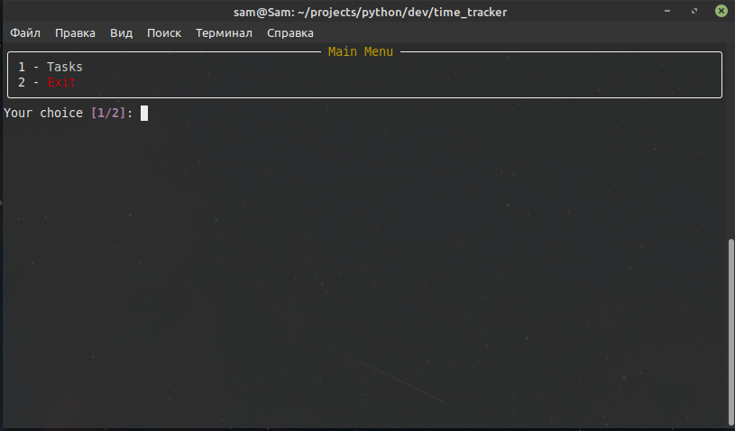
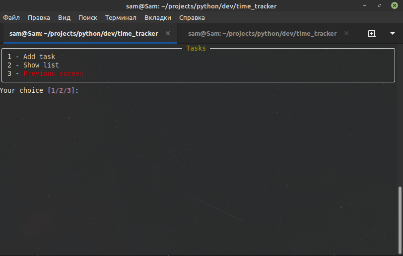
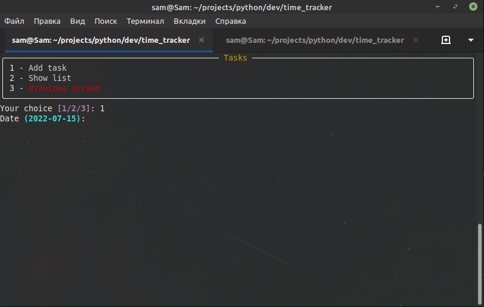
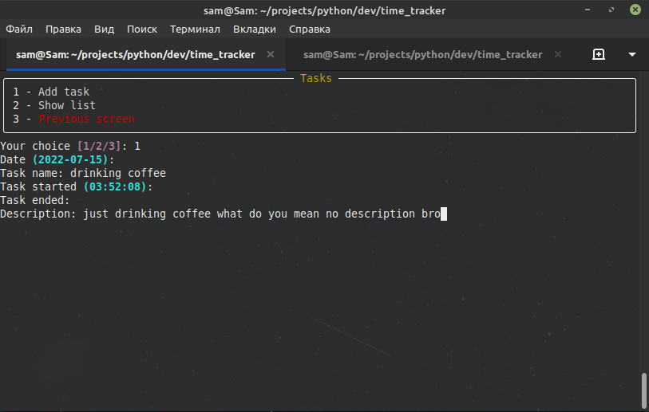
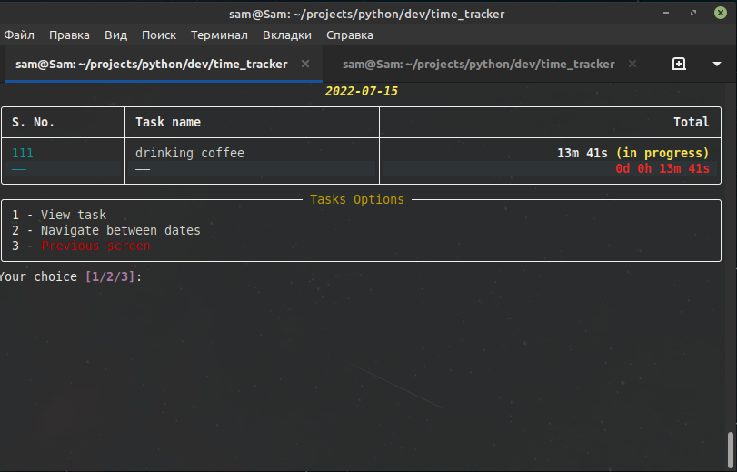
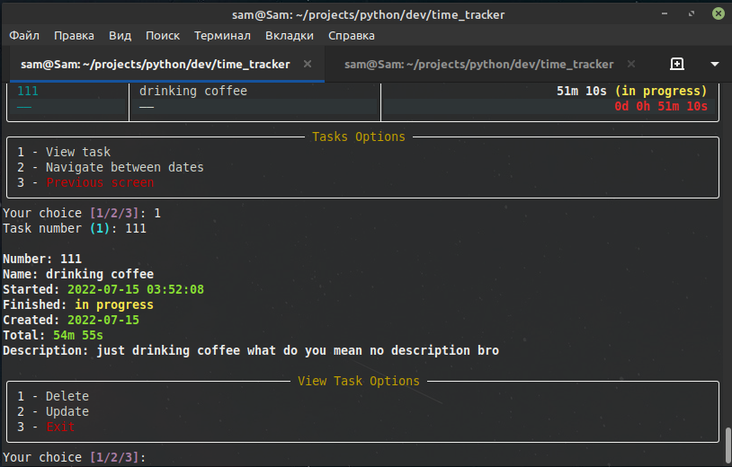
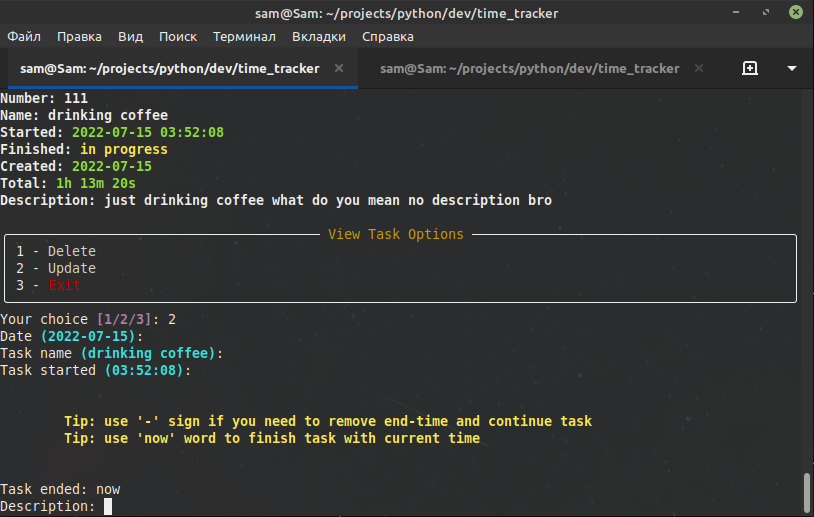
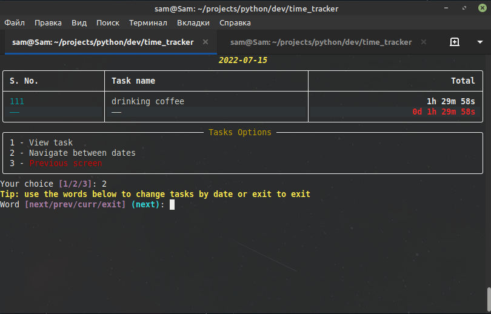

About
=================

This simple console application is created to track work-time. It handles tasks creation,
editing, deleliton, showing and exporting.

Design Principles
=================

*  Have an extremely simple setup process with a minimal learning curve.
*  Create some tasks with their name, description, optionally start time and finish time
*  Watch them by manipulating simple menu or cli
*  Update, Delete, Finish, Continue or Filter by date
*  Export

Installation
=================

### Globally

```
git clone https://github.com/SamFredrickson/Time-Tracker time_tracker

cd time_tracker

python setup.py install
```

### With virtual environment

```
git clone https://github.com/SamFredrickson/Time-Tracker time_tracker

cd time_tracker

python -m venv venv 

source venv/bin/activate

python setup.py install
```

### Have a try with docker

Just take a look at the app. Download and remove container after exit.

```
docker run -it --rm samfredrickson/timetracker sh
```

Use this command to keep container running

```
docker run -it samfredrickson/timetracker sh
```

After successfull pulling of image you jump into container env where you can execute any commands.

Read *Usage* section below to find out availiable commands.

Usage
=================

The console application allows you to manipulate tasks in two ways:

1. Menu ``tracker menu``
2. Console commands ``tracker [command] [arguments]``

Use ``tracker --help`` to show availiable commands

Use ``tracker [command] --help`` to show help for specfic console command

### Menu

Menu is one of the ways to manipulate tasks, to start working with menu type ``tracker menu`` command.
You will see something like this:



1. Tasks - task actions (add, show)
2. Exit - leave menu

Let's see what's inside tasks



1. Add task - redirects us to another section of our menu where we create task
2. Show list - is a list of our tasks for today (by default)
3. Previous screen - immediately obvious our previous section

### Create first task

If you are in Tasks section just enter "1" and read carefully what to you need to know next.



You will be asked to fill fields below consistently

1. Date (optional)
2. Task name (required)
3. Task started (required)
4. Task ended (optional)
5. Tags (optional)
6. Description (optional)

**WARNING! Cyan values in parentheses are default values and you dont need to copy them**

*Date*

By default, Date is current day's date of your computer system. If you want to create a task for yesterday or for tomorrow you must enter this date in proper format (2022-02-02)

*Task name*

Task name is just a task name, enter short name. Example (drinking coffee)

*Task started*

By default, Task started is current time of your computer system. If you want to create a task with specific time you must enter this time in proper format (15:30:00)

*Task ended*

Task ended is time you finish task, it's optional and you can leave it empty. In case you forgot to create a task you can enter time in proper format (03:00:00).

*Tags*

Tags are literally a couple of words about the task you create. It might be used in task-export command to export tasks which include these tags.

*Description*

Description is optional and you can leave it empty.

So, our final result is:



After filling all fields and pressing "enter" key your task is created and menu switched to it's initial state.

### Watch your tasks

If you are in Tasks section just enter "2" (Show list).

You will be asked to input fields below consistently

1. Choose date from (required)
2. Choose date to (required)

By default, both of these fields are current day's date of your computer system. So, if you need to get a list of tasks for today just press enter twice quickly, that's it.

In case you want to get a list of tasks from 2022-02-02 to 2022-07-15 your fields must be filled this way:

**Choose date from (2022-07-15): 2022-02-02**

**Choose date from (2022-07-15): 2022-07-15**

Let's get our task for today by pressing "enter" key twice.



Well, we see our first task here that's still in progress.

In application exists only one status of task (in progress). In progress status indicates that task is running and time is ticking.

You if you see task with no in progress status it means task is not running and time is not ticking anymore.

**Task list structure**

Task list structure is quite simple.

1. Date
2. Table
3. Options

Date is chosen date in previous section (2022-07-15). If you chose date range (2022-02-02 to 2022-07-15) date would look differently (2022-02-02-2022-07-15)

Table consists of three columns:

1. Task Number
2. Task Name
3. Spent Time

Last row has red text on black background and shows total spent time of all tasks.

**Tasks options:**

There's tasks options under table.

1. View task
2. Navigate between dates
3. Previous screen

**View task**

If you are in list of tasks section enter "1" (View Task).

You will be asked to fill task id.

1. Task number (required)

*Task number*

By default, task number is 1. In our case task number is 111.
If your task exists you get complete descritpion and new options.



**View tasks options**

1. Delete
2. Update
3. Exit or previous screen

**Delete**

If you choose to delete task you will run into a prompt:

Task: "task number" - "task name"

Are you sure? [y/n]:

Enter y to delete

Enter n to leave

**Update**

Update is one the ways to stop or continue task.

If you choose to update task you will be asked to fill fields:

1. Date (optional)
2. Task name (optional)
3. Task started (optional)
4. Task ended (optional)
5. Tags (optional)
6. Description (optional)

All fields are optional because they're already filled.

Let's look at the final result:



During updating you can see these two tips on the screen

In my case, the task is running and that's why we don't see default value next to "Task ended:" option. Type "now" to finish a task with current system time.

If you wish you can enter time in proper format (15:00:00) instead of "now" or "-".

**Navigating between dates**

Dates navigation is option in task list menu that allows you to change list with new date



Avialables options in navigiation mode:

1. Next - gets a list with a next date
2. Prev - gets a list with a previous date
3. Curr - gets a list with a current date
4. Exit

After getting a list with date you need type "exit".

## Console

Personally, console is more comfortable way to manipulate tasks.

**If you didn't read Menu guide above i strongly recommend to do it, because console commands will show you main interface components we described before.**

Let's what commands we have by typing ``tracker --help``

```
Usage: Time tracker [OPTIONS] COMMAND [ARGS]...

Options:
  -v, --version         Show the application's version and exit.
  --install-completion  Install completion for the current shell.
  --show-completion     Show completion for the current shell, to copy it or
                        customize the installation.
  --help                Show this message and exit.

Commands:
  menu           Shows main menu
  task-continue  Continue stopped task
  task-create    Create task
  task-delete    Delete task
  task-export    Export tasks to file
  task-list      Shows tasks list
  task-stop      Stop running task
  task-update    Update task
  task-view      View task info

```

You are already familiar with ``tracker menu`` command.

There's no point to describe each of them because they've been already described in your terminal.

To get description for a specific command type ``tracker [command] --help``. For example, ``tracker task-list --help``

```Usage: Time tracker task-list [OPTIONS]

  Shows tasks list

Options:
  --date-from TEXT  Date from, default today  [default: 2022-07-16]
  --date-to TEXT    Date to, default today  [default: 2022-07-16]
  --help            Show this message and exit.
```

As we know task-list is section where we can watch our tasks. In menu mode we must provide some extra info like date range before get list. Task list console command is not an exception. 

Enter ``tracker task-list`` command to get list for today. 

Enter ``tracker task-list --date-from 2022-02-02 --date-to 2022-03-04`` to list from and to specific days.

So, these console commands work in the same way like menu mode, but you don't need to launch menu mode every time.

Use console commands and CTRL + C combinations for better experience. 

Authors
=======

The console application was created by `Sam Fredrickson <https://github.com/samFredrickson/>`